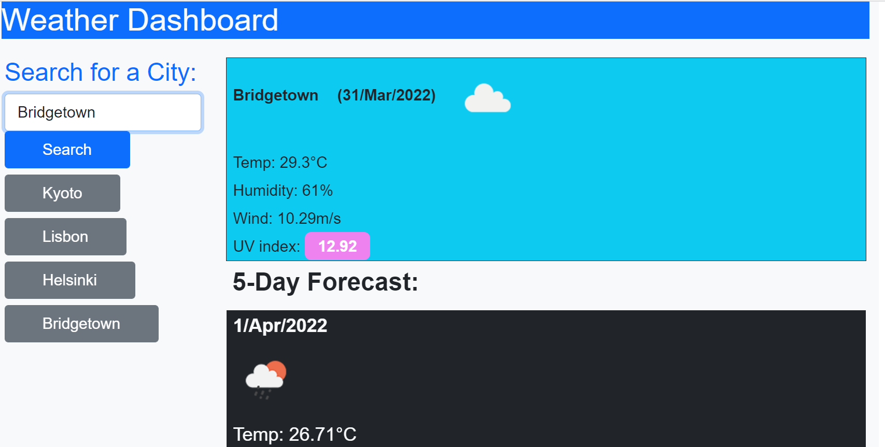

# HW06-ServerSideAPIs-Weather-Dashboard

Server-Side APIs: Weather Dashboard 

This is a webpage that allows you to check the weather of a city which provides current weather conditions and a five-day forecast. The weather information is provided by the server-side APIs from OpenWeather: [https://openweathermap.org/](https://openweathermap.org/)

The webpage features dynamic HTML and CSS elements, the CSS styling and layout uses Bootstrap: [https://getbootstrap.com/](https://getbootstrap.com/)

The moment.js library is used to convert the unix timestamp of the weather forecast into a date.

Search history is saved to local storage and clicking on the buttons that save your history will search that location again.

Link to deployed application: [https://r134x7.github.io/HW06-ServerSideAPIs-Weather-Dashboard/](https://r134x7.github.io/HW06-ServerSideAPIs-Weather-Dashboard/)

This is only a screenshot: 
